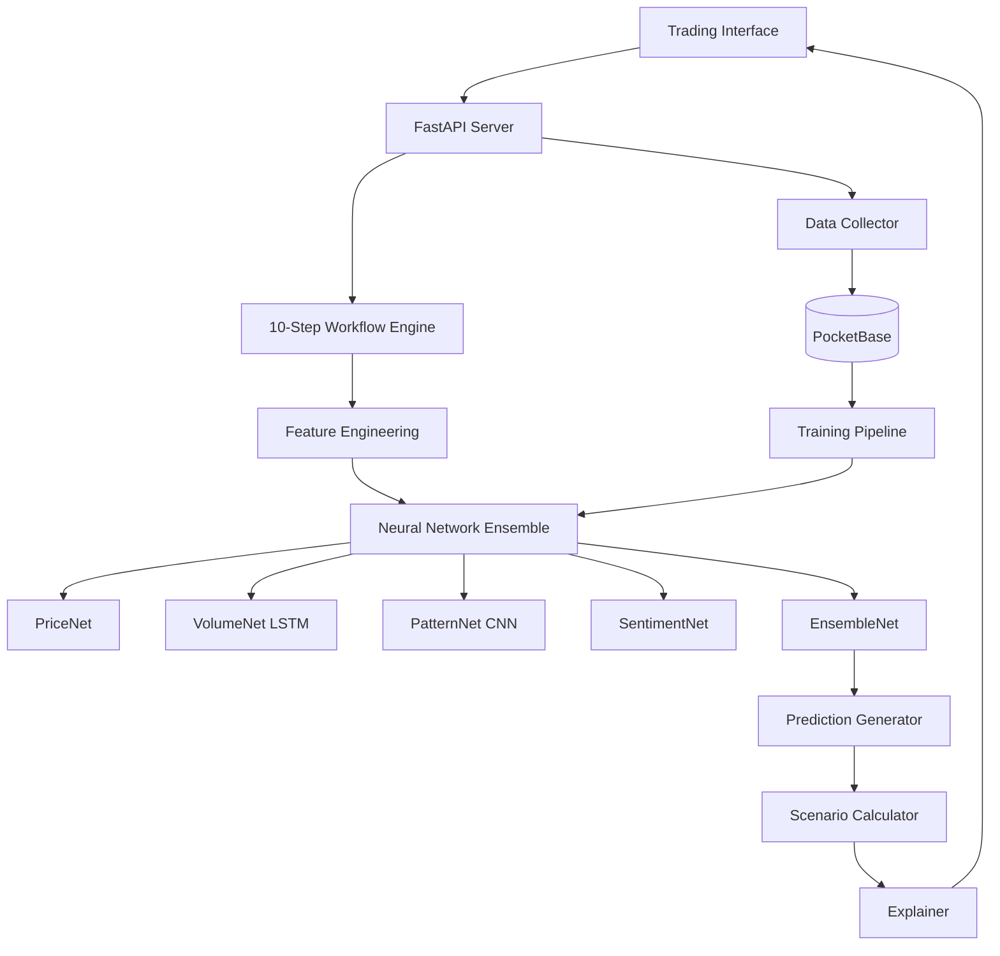

# ANFA Neural Trading System Design

## Overview

The ANFA Neural Trading System uses an ensemble of specialized neural networks to predict stock price movements with high accuracy. The Stock Price Prediction System is a hybrid quantitative-qualitative model that combines polynomial regression with live data and qualitative market factors to generate three prediction scenarios (conservative, bullish, bearish) for any publicly traded security. The system is designed for futures trading with a focus on high accuracy and fast capital building. Unlike generic AI models, these networks are purpose-built for catalyasts and context, trained on actual market data, and continuously improve through automated retraining. The system combines deep learning with systematic analysis through a 10-step workflow that provides both accurate predictions and clear explanations.

## System Architecture



## Neural Network Designs

### 1. PriceNet - Price Movement Predictor

**Purpose:** Analyze price-based technical indicators to predict direction

**Architecture:**
```python
Input Layer (50 features)
    ↓
Dense Layer (128 neurons, ReLU)
    ↓
Dropout (0.2)
    ↓
Dense Layer (64 neurons, ReLU)
    ↓
Dropout (0.2)
    ↓
Dense Layer (32 neurons, ReLU)
    ↓
Output Layer (3 classes: down, flat, up)
```

**Input Features:**
- RSI (14, 21, 30 periods)
- MACD (signal, histogram)
- Bollinger Bands position
- Moving averages (5, 10, 20, 50, 100, 200)
- Price momentum
- Rate of change
- Stochastic oscillator
- ATR normalized
- Price relative to VWAP
- And 30+ more indicators

**Training Details:**
- Loss: Cross-entropy
- Optimizer: Adam (lr=0.001)
- Batch size: 32
- Epochs: 100
- Validation split: 20%

### 2. VolumeNet - Volume Pattern Analyzer

**Purpose:** Detect volume patterns that precede price movements

**Architecture:**
```python
Input Sequence (20 timesteps × 10 features)
    ↓
LSTM Layer 1 (50 hidden units)
    ↓
LSTM Layer 2 (50 hidden units)
    ↓
Dense Layer (3 classes: bearish, neutral, bullish)
```

**Input Features (per timestep):**
- Volume
- Volume ratio to average
- Buy volume percentage
- Large trade count
- Tick count
- Spread
- Trade size distribution
- Accumulation/distribution
- On-balance volume
- Volume-price trend

**Training Details:**
- Sequence length: 20 bars
- Stateful LSTM for continuity
- Gradient clipping: 1.0
- Learning rate scheduling

### 3. PatternNet - Chart Pattern Recognition

**Purpose:** Identify chart patterns using convolutional neural network

**Architecture:**
```python
Input (1 × 100 price points)
    ↓
Conv1D (32 filters, kernel=5, ReLU)
    ↓
MaxPool1D (size=2)
    ↓
Conv1D (64 filters, kernel=3, ReLU)
    ↓
MaxPool1D (size=2)
    ↓
Flatten
    ↓
Dense (128 neurons, ReLU)
    ↓
Output (10 pattern classes)
```

**Pattern Classes:**
1. Bull flag
2. Bear flag
3. Head and shoulders
4. Inverse H&S
5. Triangle (ascending)
6. Triangle (descending)
7. Double top
8. Double bottom
9. Channel
10. No clear pattern

**Training Details:**
- Data augmentation with noise
- Pattern labeling via rule-based detection
- Transfer learning from larger dataset
- Class weighting for imbalanced data

### 4. SentimentNet - News & Social Sentiment

**Purpose:** Analyze text data for market sentiment

**Architecture:**
```python
Input (Token sequence)
    ↓
Embedding (10000 vocab × 128 dims)
    ↓
LSTM (256 hidden units)
    ↓
Dense (3 classes: bearish, neutral, bullish)
```

**Data Sources:**
- Financial news headlines
- Reddit WSB posts
- Twitter mentions
- Analyst reports
- SEC filings

**Training Details:**
- Pre-trained embeddings (fine-tuned)
- Attention mechanism for key phrases
- Multi-task learning (sentiment + relevance)

### 5. EnsembleNet - Meta Predictor

**Purpose:** Combine all network outputs into final prediction

**Architecture:**
```python
Input (19 features from all networks)
    ↓
Dense (64 neurons, ReLU)
    ↓
Dropout (0.3)
    ↓
Dense (32 neurons, ReLU)
    ↓
Output (3 classes + confidence score)
```

**Input Composition:**
- PriceNet: 3 probabilities
- VolumeNet: 3 probabilities
- PatternNet: 10 pattern probabilities
- SentimentNet: 3 probabilities
- Total: 19 inputs

**Training Details:**
- Trained end-to-end with all networks
- Weighted loss based on network reliability
- Confidence calibration using temperature scaling

## 10-Step Workflow Implementation

### Step 1: Time Context Encoding
```python
class TimeContextEncoder:
    def encode(self, timestamp: datetime) -> torch.Tensor:
        # Cyclical encoding for neural networks
        hour_sin = np.sin(2 * np.pi * timestamp.hour / 24)
        hour_cos = np.cos(2 * np.pi * timestamp.hour / 24)
        
        dow_sin = np.sin(2 * np.pi * timestamp.weekday() / 7)
        dow_cos = np.cos(2 * np.pi * timestamp.weekday() / 7)
        
        features = [
            hour_sin, hour_cos,
            dow_sin, dow_cos,
            timestamp.day / 31,
            timestamp.month / 12,
            self.is_market_hours(timestamp),
            self.minutes_from_open(timestamp) / 390,
            self.days_to_earnings(timestamp) / 90,
            self.days_to_opex(timestamp) / 30
        ]
        
        return torch.tensor(features)
```

### Step 2: Feature Engineering Pipeline
```python
class FeatureEngineer:
    def __init__(self):
        self.scalers = {}
        self.load_scalers()
    
    def engineer_all_features(self, data: MarketData) -> FeatureSet:
        price_features = self.engineer_price_features(data)
        volume_features = self.engineer_volume_features(data)
        time_features = self.engineer_time_features(data.timestamp)
        
        # Normalize to [-1, 1] for neural networks
        price_features = self.scalers['price'].transform(price_features)
        volume_features = self.scalers['volume'].transform(volume_features)
        
        return FeatureSet(
            price=torch.tensor(price_features),
            volume=torch.tensor(volume_features),
            time=time_features
        )
```

### Step 3-6: Network Execution
```python
class NetworkExecutor:
    def __init__(self):
        self.price_net = self.load_model('price_net.pth')
        self.volume_net = self.load_model('volume_net.pth')
        self.pattern_net = self.load_model('pattern_net.pth')
        self.sentiment_net = self.load_model('sentiment_net.pth')
    
    async def run_all_networks(self, features: FeatureSet) -> NetworkOutputs:
        # Run networks in parallel for speed
        tasks = [
            self.run_price_net(features.price),
            self.run_volume_net(features.volume),
            self.run_pattern_net(features.chart),
            self.run_sentiment_net(features.text)
        ]
        
        results = await asyncio.gather(*tasks)
        
        return NetworkOutputs(
            price=results[0],
            volume=results[1],
            pattern=results[2],
            sentiment=results[3]
        )
```

### Step 7: Ensemble Prediction
```python
class EnsemblePredictior:
    def __init__(self):
        self.ensemble_net = self.load_model('ensemble_net.pth')
    
    def predict(self, network_outputs: NetworkOutputs) -> Prediction:
        # Concatenate all network outputs
        combined = torch.cat([
            network_outputs.price,
            network_outputs.volume,
            network_outputs.pattern,
            network_outputs.sentiment
        ])
        
        # Run through ensemble network
        with torch.no_grad():
            output = self.ensemble_net(combined)
            probabilities = F.softmax(output, dim=0)
        
        return Prediction(
            direction=torch.argmax(probabilities),
            probabilities=probabilities,
            confidence=torch.max(probabilities)
        )
```

### Step 8: Scenario Generation
```python
class ScenarioGenerator:
    def generate(self, prediction: Prediction, current_price: float) -> Scenarios:
        base_move = self.prediction_to_percent(prediction)
        confidence = prediction.confidence.item()
        
        # Historical volatility for this confidence level
        volatility = self.get_historical_volatility(confidence)
        
        scenarios = {
            'conservative': {
                'target': current_price * (1 + base_move * 0.5),
                'stop_loss': current_price * (1 - volatility * 0.5),
                'confidence': confidence * 0.8,
                'size': self.kelly_criterion(confidence * 0.8, 0.5)
            },
            'expected': {
                'target': current_price * (1 + base_move),
                'stop_loss': current_price * (1 - volatility * 0.75),
                'confidence': confidence,
                'size': self.kelly_criterion(confidence, 1.0)
            },
            'aggressive': {
                'target': current_price * (1 + base_move * 1.5),
                'stop_loss': current_price * (1 - volatility),
                'confidence': confidence * 0.6,
                'size': self.kelly_criterion(confidence * 0.6, 1.5)
            }
        }
        
        return Scenarios(**scenarios)
```

### Step 9: Risk Calculation
```python
class RiskCalculator:
    def calculate(self, scenarios: Scenarios, portfolio: Portfolio) -> RiskMetrics:
        metrics = {}
        
        for name, scenario in scenarios.items():
            reward = scenario['target'] - current_price
            risk = current_price - scenario['stop_loss']
            
            metrics[name] = {
                'risk_reward': reward / risk,
                'expected_value': (
                    scenario['confidence'] * reward - 
                    (1 - scenario['confidence']) * risk
                ),
                'var_95': self.calculate_var(scenario, 0.95),
                'max_drawdown': risk / current_price,
                'portfolio_impact': scenario['size'] * portfolio.value
            }
        
        return RiskMetrics(**metrics)
```

### Step 10: Explanation Generation
```python
class PredictionExplainer:
    def explain(self, 
                network_outputs: NetworkOutputs,
                prediction: Prediction,
                scenarios: Scenarios) -> Explanation:
        
        # Identify primary driver
        contributions = self.calculate_contributions(network_outputs)
        primary = max(contributions, key=contributions.get)
        
        # Find supporting and conflicting signals
        supporting = [k for k, v in contributions.items() 
                     if v > 0 and k != primary]
        conflicting = [k for k, v in contributions.items() if v < 0]
        
        # Find similar historical setups
        similar = self.find_similar_setups(network_outputs)
        
        return Explanation(
            primary_driver=f"{primary} network ({contributions[primary]:.1%})",
            supporting_factors=supporting,
            conflicting_signals=conflicting,
            confidence_breakdown=contributions,
            similar_setups=similar,
            historical_accuracy=self.calculate_accuracy(similar),
            reasoning=self.generate_reasoning(network_outputs, prediction)
        )
```

## Data Pipeline Design

### Real-Time Collection
```python
class DataCollector:
    def __init__(self):
        self.pb = PocketBase('http://localhost:8090')
        self.sources = {
            'polygon': PolygonClient(),
            'finnhub': FinnhubClient(),
            'sec': SECAPIClient()
        }
    
    async def collect_continuous(self):
        while True:
            # Parallel data collection
            tasks = [
                self.collect_prices(),
                self.collect_options(),
                self.collect_news(),
                self.collect_insider_trades()
            ]
            
            data = await asyncio.gather(*tasks)
            
            # Store in PocketBase
            await self.store_training_data(data)
            
            # Run predictions if market open
            if self.is_market_open():
                await self.trigger_prediction(data)
            
            await asyncio.sleep(60)  # Every minute
```

### Training Pipeline
```python
class TrainingPipeline:
    def __init__(self):
        self.pb = PocketBase('http://localhost:8090')
        self.models = {}
    
    def nightly_retrain(self):
        # Pull day's data
        data = self.pb.collection('training_data').get_list(
            filter=f"created >= '{datetime.now() - timedelta(days=1)}'"
        )
        
        # Prepare datasets
        datasets = self.prepare_datasets(data)
        
        # Train each network
        results = {}
        results['price'] = self.train_price_net(datasets['price'])
        results['volume'] = self.train_volume_net(datasets['volume'])
        results['pattern'] = self.train_pattern_net(datasets['pattern'])
        results['sentiment'] = self.train_sentiment_net(datasets['sentiment'])
        
        # Train ensemble with frozen base networks
        results['ensemble'] = self.train_ensemble(datasets['all'])
        
        # Validate and deploy if better
        if self.validate(results) > self.current_accuracy:
            self.deploy_models(results)
        
        # Log performance
        self.log_training_results(results)
```

## PocketBase Schema

### Collections Design

```javascript
// Training data collection
pb.collection('training_data').create({
  schema: [
    { name: 'symbol', type: 'text', required: true },
    { name: 'timestamp', type: 'date', required: true },
    { name: 'price_features', type: 'json' },
    { name: 'volume_features', type: 'json' },
    { name: 'pattern_features', type: 'json' },
    { name: 'sentiment_features', type: 'json' },
    { name: 'price_t0', type: 'number' },
    { name: 'price_t1', type: 'number' },
    { name: 'price_t5', type: 'number' },
    { name: 'price_t60', type: 'number' },
    { name: 'actual_move', type: 'number' },
    { name: 'actual_direction', type: 'select', options: ['down', 'flat', 'up'] }
  ]
});

// Model registry
pb.collection('models').create({
  schema: [
    { name: 'model_name', type: 'text', required: true },
    { name: 'version', type: 'text' },
    { name: 'architecture', type: 'json' },
    { name: 'training_date', type: 'date' },
    { name: 'training_samples', type: 'number' },
    { name: 'validation_accuracy', type: 'number' },
    { name: 'test_accuracy', type: 'number' },
    { name: 'live_accuracy', type: 'number' },
    { name: 'parameters_url', type: 'url' },
    { name: 'is_active', type: 'bool' }
  ]
});

// Predictions tracking
pb.collection('predictions').create({
  schema: [
    { name: 'symbol', type: 'text', required: true },
    { name: 'timestamp', type: 'date', required: true },
    { name: 'price_net_output', type: 'json' },
    { name: 'volume_net_output', type: 'json' },
    { name: 'pattern_net_output', type: 'json' },
    { name: 'sentiment_net_output', type: 'json' },
    { name: 'ensemble_output', type: 'json' },
    { name: 'scenarios', type: 'json' },
    { name: 'explanation', type: 'json' },
    { name: 'actual_price_1h', type: 'number' },
    { name: 'actual_price_1d', type: 'number' },
    { name: 'accuracy_score', type: 'number' }
  ]
});
```

## Deployment Architecture

### Production Setup (Fedora Server)

```yaml
# docker-compose.yml
version: '3.8'

services:
  pocketbase:
    image: pocketbase:latest
    ports:
      - "8090:8090"
    volumes:
      - ./pb_data:/pb_data
    restart: always
  
  prediction_api:
    build: ./api
    ports:
      - "8000:8000"
    environment:
      - PB_URL=http://pocketbase:8090
    depends_on:
      - pocketbase
    volumes:
      - ./models:/app/models
    restart: always
  
  data_collector:
    build: ./collector
    environment:
      - PB_URL=http://pocketbase:8090
      - POLYGON_API_KEY=${POLYGON_API_KEY}
    depends_on:
      - pocketbase
    restart: always
  
  trainer:
    build: ./trainer
    environment:
      - PB_URL=http://pocketbase:8090
    volumes:
      - ./models:/app/models
    depends_on:
      - pocketbase
```

### Cron Schedule

```bash
# Data collection (every minute during market hours)
* 9-16 * * 1-5 docker exec data_collector python collect_tick.py

# Feature calculation (every 5 minutes)
*/5 * * * * docker exec data_collector python calculate_features.py

# Model prediction (every minute during market)
* 9-16 * * 1-5 docker exec prediction_api python run_predictions.py

# Model retraining (nightly at 2 AM)
0 2 * * * docker exec trainer python retrain_all.py

# Performance evaluation (6 PM daily)
0 18 * * * docker exec trainer python evaluate_performance.py

# A/B testing check (hourly)
0 * * * * docker exec trainer python check_ab_tests.py
```

## Testing Strategy

### Unit Testing
- Each neural network tested independently
- Feature engineering validation
- Scenario generation accuracy
- Risk calculation correctness

### Integration Testing
- End-to-end workflow testing
- Data pipeline validation
- Model loading/saving
- API response times

### Performance Testing
- Prediction latency (<2 seconds)
- Concurrent request handling
- Memory usage under load
- Training time benchmarks

### Accuracy Testing
- Backtesting on historical data
- Paper trading validation
- A/B testing new architectures
- Cross-validation on different time periods

## Success Metrics

1. **Network Accuracy:** Each network >55% standalone
2. **Ensemble Performance:** >65% directional accuracy
3. **Prediction Speed:** <2 seconds end-to-end
4. **System Uptime:** >99.9% availability
5. **Continuous Improvement:** +2% monthly gains

This design provides a complete neural network trading system with specialized networks, continuous learning, and full explainability - exactly what's needed to beat generic AI predictions.
