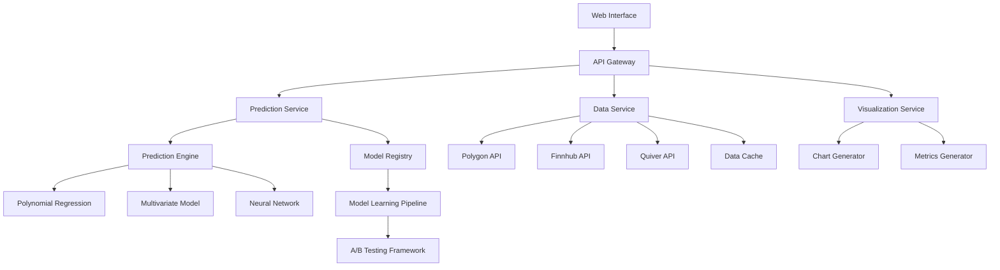

# Stock Price Prediction System Design

## Overview

The Stock Price Prediction System is a hybrid quantitative-qualitative model that combines polynomial regression with P/E ratio data and qualitative market factors to generate three prediction scenarios (conservative, bullish, bearish) for any publicly traded security. The system is designed for futures trading with a focus on high accuracy and fast capital building.

**Key Design Principles:**

- Single-stock focus per session for maximum accuracy
- Multi-model approach with automatic fallback mechanisms
- Real-time data integration with multiple source redundancy
- Continuous learning and model improvement
- Visual performance validation for trader confidence

## Architecture



**Architecture Rationale:**

- Microservices approach allows independent scaling and deployment
- Model Registry enables A/B testing and continuous improvement
- Best-in-class data sources: Polygon (institutional-grade market data), Finnhub (comprehensive fundamentals), Quiver (unique political trading edge)
- Separation of concerns between prediction, data, and visualization

## Components and Interfaces

### 1. Data Service

**Purpose:** Fetch, validate, and cache market data from multiple sources

**Key Components:**

- **Market Data Fetcher:** Polygon API (institutional-grade real-time and historical prices, volume, OHLC data)
- **Fundamentals Fetcher:** Finnhub API (P/E ratios, financial metrics, earnings data, analyst estimates)
- **Political Trading Fetcher:** Quiver Quantitative API (politician trades, insider activity, unusual options flow)
- **Data Validator:** Filters invalid/anomalous data points across all sources
- **Cache Manager:** Redis-based caching with source-specific TTL for performance

**Interface:**

```typescript
interface DataService {
  // Polygon API integration
  fetchMarketData(symbol: string, period: string): Promise<MarketData>;
  fetchRealTimePrice(symbol: string): Promise<RealTimePrice>;

  // Finnhub API integration
  fetchFundamentals(symbol: string): Promise<FundamentalData>;
  fetchPERatio(symbol: string): Promise<number>;
  fetchEarningsData(symbol: string): Promise<EarningsData>;

  // Quiver API integration
  fetchPoliticianTrades(symbol: string): Promise<PoliticianTrade[]>;
  fetchInsiderActivity(symbol: string): Promise<InsiderActivity[]>;
  fetchUnusualOptionsFlow(symbol: string): Promise<OptionsFlow[]>;

  // Data validation and caching
  validateData(data: any[], source: DataSource): any[];
  getCachedData(key: string): Promise<any>;
}
```

### 2. Prediction Engine

**Purpose:** Generate three prediction scenarios using hybrid models

**Key Components:**

- **Polynomial Regression Model:** Primary prediction algorithm
- **Multivariate Model:** Incorporates P/E ratios and volume when available
- **Neural Network Model:** Advanced model for comparison and potential upgrade
- **Scenario Generator:** Creates conservative, bullish, bearish predictions
- **Political Trading Analyzer:** Adjusts predictions based on politician trades and insider activity from Quiver

**Interface:**

```typescript
interface PredictionEngine {
  generatePredictions(stockData: StockData): Promise<PredictionResult>;
  calculateAccuracyMetrics(
    predictions: number[],
    actual: number[]
  ): AccuracyMetrics;
  adjustForPoliticalTrading(
    predictions: PredictionResult,
    trades: PoliticianTrade[],
    insiderActivity: InsiderActivity[]
  ): PredictionResult;
}
```

### 3. Model Registry

**Purpose:** Manage model versions, performance tracking, and continuous improvement

**Key Components:**

- **Model Versioning:** Track different model iterations
- **Performance Monitor:** Log actual vs predicted outcomes
- **Retraining Pipeline:** Automatic model updates based on new data
- **A/B Testing Framework:** Validate model improvements before deployment

**Interface:**

```typescript
interface ModelRegistry {
  registerModel(model: Model, version: string): void;
  getActiveModel(type: ModelType): Model;
  logPredictionOutcome(prediction: Prediction, actual: number): void;
  triggerRetraining(modelType: ModelType): Promise<void>;
}
```

### 4. Visualization Service

**Purpose:** Generate charts and performance metrics for trader confidence

**Key Components:**

- **Chart Generator:** Historical data + prediction overlays
- **Metrics Calculator:** R², RMSE, confidence intervals
- **Performance Dashboard:** Model accuracy tracking

**Interface:**

```typescript
interface VisualizationService {
  generatePredictionChart(
    data: StockData,
    predictions: PredictionResult
  ): ChartData;
  calculateMetrics(predictions: number[], actual: number[]): MetricsData;
  createPerformanceDashboard(modelStats: ModelStats[]): DashboardData;
}
```

## Data Models

### Core Data Structures

```typescript
// Polygon market data
interface MarketData {
  symbol: string;
  prices: PricePoint[];
  volume: VolumePoint[];
  timestamp: Date;
  source: "polygon";
}

// Finnhub fundamental data
interface FundamentalData {
  symbol: string;
  peRatio: number;
  forwardPE: number;
  marketCap: number;
  eps: number;
  revenue: number;
  revenueGrowth: number;
  timestamp: Date;
  source: "finnhub";
}

// Combined stock data
interface StockData {
  symbol: string;
  marketData: MarketData;
  fundamentals: FundamentalData;
  politicalTrades?: PoliticianTrade[];
  insiderActivity?: InsiderActivity[];
  timestamp: Date;
}

interface PricePoint {
  date: Date;
  open: number;
  high: number;
  low: number;
  close: number;
  adjustedClose: number;
  vwap?: number; // Polygon provides VWAP
}

interface VolumePoint {
  date: Date;
  volume: number;
  transactions?: number; // Polygon provides transaction count
}

interface PredictionResult {
  symbol: string;
  conservative: PredictionScenario;
  bullish: PredictionScenario;
  bearish: PredictionScenario;
  accuracy: AccuracyMetrics;
  confidence: number;
  timestamp: Date;
}

interface PredictionScenario {
  targetPrice: number;
  timeframe: string;
  probability: number;
  factors: string[];
}

interface AccuracyMetrics {
  rSquared: number;
  rmse: number;
  mape: number;
  confidenceInterval: [number, number];
}

// Quiver political trading data
interface PoliticianTrade {
  politician: string;
  party: string;
  chamber: "House" | "Senate";
  symbol: string;
  tradeType: "BUY" | "SELL";
  amount: number;
  minAmount: number;
  maxAmount: number;
  date: Date;
  reportDate: Date;
  impact: "HIGH" | "MEDIUM" | "LOW";
  source: "quiver";
}

interface InsiderActivity {
  insider: string;
  title: string;
  symbol: string;
  tradeType: "BUY" | "SELL";
  shares: number;
  price: number;
  value: number;
  date: Date;
  filingDate: Date;
  source: "quiver";
}

interface OptionsFlow {
  symbol: string;
  optionType: "CALL" | "PUT";
  strike: number;
  expiration: Date;
  volume: number;
  openInterest: number;
  premium: number;
  unusualActivity: boolean;
  date: Date;
  source: "quiver";
}
```

**Data Model Rationale:**

- Structured to support both simple and complex prediction models
- Flexible enough to accommodate different data sources
- Includes metadata for tracking and validation
- Supports both historical analysis and real-time predictions

## Error Handling

### Data Source Failures

- **Polygon API Issues:** Implement retry logic with exponential backoff, respect rate limits (5 calls/min free, 1000/min paid)
- **Finnhub API Issues:** Handle rate limits (60 calls/min free, 600/min paid), implement intelligent caching
- **Quiver API Issues:** Graceful degradation when political data unavailable, cache recent trades
- **Invalid Data:** Filter and log anomalies per source, continue with valid subset
- **Cross-Source Validation:** Verify price data consistency between sources when possible
- **Network Issues:** Retry logic with circuit breaker pattern per API endpoint

### Model Failures

- **Insufficient Data:** Fall back to simpler models (univariate → basic trend)
- **Poor Model Performance:** Trigger retraining pipeline
- **Prediction Errors:** Return confidence intervals and uncertainty metrics
- **Memory/Compute Issues:** Implement graceful degradation

### User Experience

- **Clear Error Messages:** Specific, actionable feedback for users
- **Graceful Degradation:** Partial results when full analysis fails
- **Status Indicators:** Real-time feedback on data fetching and processing
- **Fallback Visualizations:** Basic charts when advanced features fail

## Testing Strategy

### Unit Testing

- **Data Validation:** Test filtering and cleaning algorithms
- **Model Accuracy:** Validate prediction algorithms against known datasets
- **API Integration:** Mock external services for reliable testing
- **Error Handling:** Test all failure scenarios and fallback mechanisms

### Integration Testing

- **End-to-End Workflows:** Complete prediction pipeline testing
- **Data Source Integration:** Test with real API responses
- **Model Performance:** Validate accuracy metrics calculation
- **Visualization Generation:** Test chart and metrics creation

### Performance Testing

- **Load Testing:** Multiple concurrent prediction requests
- **Data Volume Testing:** Large historical datasets
- **Response Time:** Sub-second prediction generation
- **Memory Usage:** Efficient handling of large datasets

### A/B Testing Framework

- **Model Comparison:** Test new models against current production
- **Feature Validation:** Gradual rollout of new capabilities
- **Performance Monitoring:** Real-time accuracy tracking
- **Rollback Capability:** Quick reversion if performance degrades

**Testing Rationale:**

- Comprehensive testing ensures reliability for trading decisions
- A/B testing enables safe continuous improvement
- Performance testing validates system scalability
- Mock testing reduces dependency on external services during development
